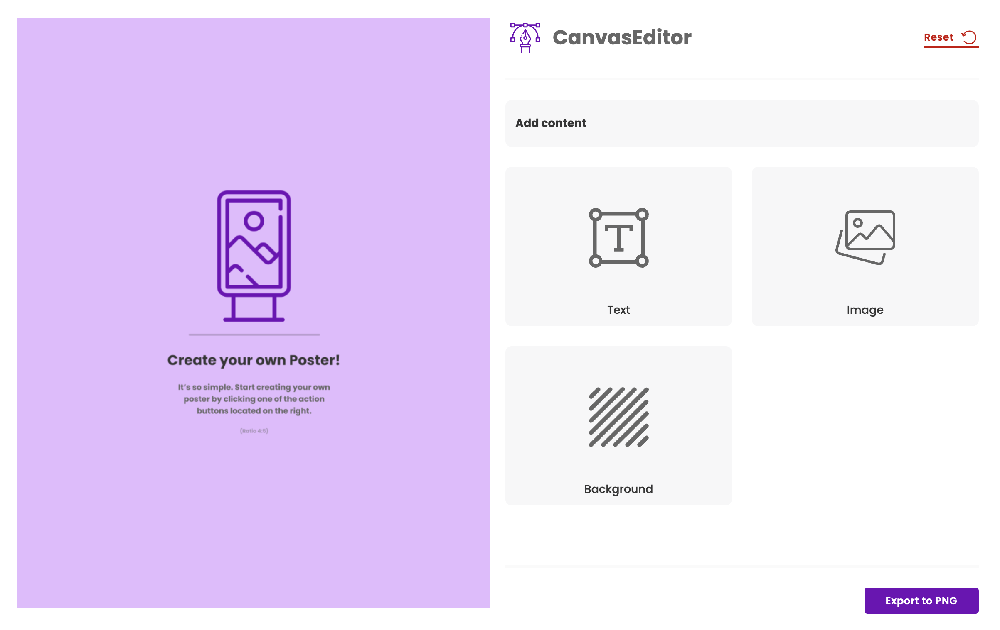
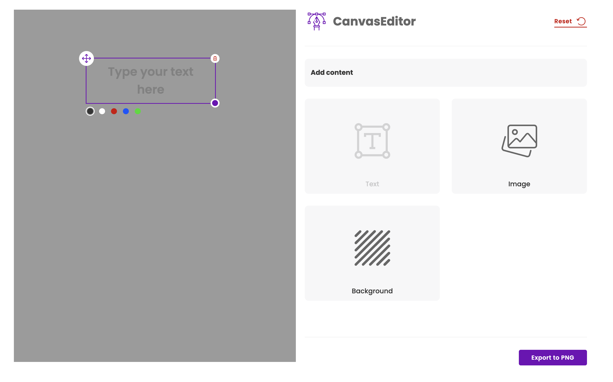
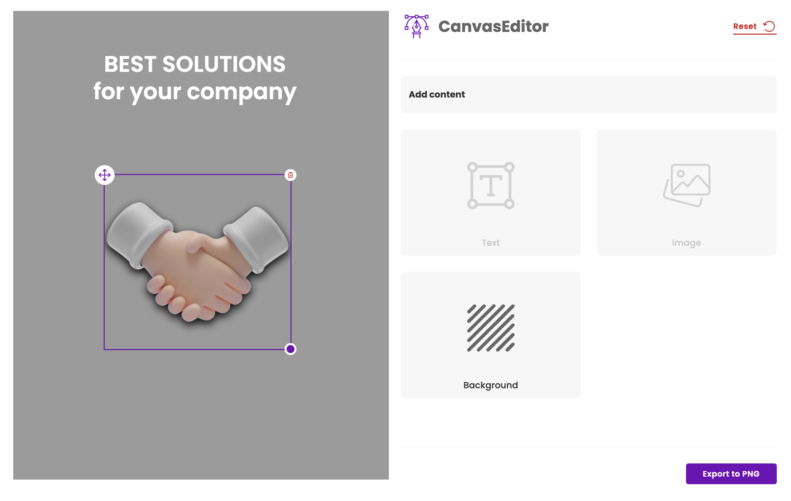

<div style="display: flex; align-items: center;">
  
  <h1>CanvasEditor</h1>
</div>

## Tech Stack
- React
- Typescript
- Tailwind
- DOM to Image

## Instalation
Requires Node.js v4.18+, v16+. to run.


```sh
$ git clone https://github.com/danekkkk/CanvasEditor.git
$ npm i
$ npm run dev
```

## Features
- Add text and image to the canvas
- Remove text or image from the canvas
- Change the color of the text
- Resize image or text on the canvas
- Move elements around the canvas using drag and drop
- Export the canvas content to PNG format (1080px x 1350px)
- Change the background image of the canvas

## Screenshots





